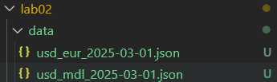
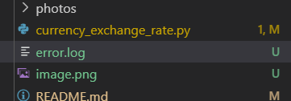

## Lab №2
#### Student: Djurinschi Andrei
#### Group: I2302


------

-- установка библиотеки requests для выполнения http запросов

```bash
pip install requests
```

-- функция для парсинга аргументов скрипта

возвращает объект, аргументы которого читаются как поля. 

параметры при добавлении:

`required` - обязательный аргумент

`help` - для вывода сообщения если аргумент не указан 


```py

def parse_args():
    parser = argparse.ArgumentParser(description="Currency exchange rate script")
    parser.add_argument("--from-currency", required=True, help="Enter source currency (e.g. USD)")
    parser.add_argument("--to-currency", required=True, help="Enter target currency (e.g. EUR)")
    parser.add_argument("--date", required=True, help="Enter date YYYY-MM-DD")
    parser.add_argument("--key", required=True, help="API key for auth")
    return parser.parse_args()

```

-- функция для проверки корректности даты и диапазона дат

* если формат даты не верный - выбрасывает ошибку с сообщением

* если дата не в указанном диапазоне, так же выбрасывается ошибка

обыект даты возвращается при отутсвии ошибок

```py
def validate_date(date_str):
    try:
        date = datetime.strptime(date_str, "%Y-%m-%d").date()
    except ValueError:
        raise argparse.ArgumentTypeError("Incorrect date format. Please use YYYY-MM-DD.")
    
    if not (datetime(2025, 1, 1).date() <= date <= datetime(2025, 9, 15).date()):
        raise ValueError("Date out of range (2025-01-01 .. 2025-09-15).")
    return date
```

-- функция, которая строит url запрос к получению данных

функция принимает 4 параметра

`from_currency` - код исходной валюты
`to_currency` - код целевой валюты
`date` - дата
`api_key` - ключ из .env файла

первым делом функция проверяет дату, далее отправляет запрос и созраняет его как json объект. если ключ `error` не пустой - выбрасывается исклчюение, иначе объект возвращается.

при налии ошибок - происходит их запись в log файл

```py

def fetch_exchange_rate(from_currency, to_currency, date, api_key):
    validate_date(date)
    base_url = f"http://localhost:8080/?from={from_currency}&to={to_currency}&date={date}"
    try:
        response = requests.post(base_url, data={"key": api_key})
        response.raise_for_status()
        data = response.json()

        if "error" in data and data["error"]:
            raise ValueError(data["error"])

        return data
    except Exception as e:
        log_error(str(e))
        print(f"Error: {e}")
        sys.exit(1)

```

-- функция, сохранябщая результат в директорию `data` при удачном запросе

```py
def save_result(data, from_cur, to_cur, date):
    os.makedirs("data", exist_ok=True)
    filename = f"data/{from_cur.lower()}_{to_cur.lower()}_{date}.json"
    with open(filename, "w", encoding="utf-8") as f:
        json.dump(data, f, ensure_ascii=False, indent=2)
    print(f"Saved: {filename}")
```

-- функция, записывающая логи в файл при ошибках 

```py
def log_error(message):
    with open("error.log", "a", encoding="utf-8") as f:
        f.write(message + "\n")
```

-- точка входа в программу

```py
def main():
    args = parse_args()

    from_currency = args.from_currency
    to_currency = args.to_currency
    date = args.date
    api_key = args.key

    data = fetch_exchange_rate(from_currency, to_currency, date, api_key)
    save_result(data, from_currency, to_currency, date)
```

> результат работы

```bash
PS C:\Users\djuri\Automation-and-Scripting\lab02> python currency_exchange_rate.py --from-currency USD --to-currency EUR --date 2025-03-01 --key EXAMPLE_API_KEY
>>                                                python currency_exchange_rate.py --from-currency USD --to-currency MDL --date 2025-03-01 --key EXAMPLE_API_KEY
>> C:\Users\djuri\Automation-and-Scripting\lab02>
Saved: data/usd_mdl_2025-03-01.json
```



```json
{
  "error": "",
  "data": {
    "from": "USD",
    "to": "MDL",
    "rate": 0.0536454784908454,
    "date": "2025-03-01"
  }
}
```

> результат при ошибках:

```bash
>> C:\Users\djuri\Automation-and-Scripting\lab02> python currency_exchange_rate.py --from-currency MDL --to-currency RUB --date 2025-03-01 --key EXAMPLE_API_KEYta/usd_mdl_2025-03-01.json
>> C:\Users\djuri\Automation-and-Scripting\lab02>
Error: The currency RUB is unknown
```

`error.log`



```log
The currency RUB is unknown
```

----

команды для запуска скрипта:

# курс usd → eur на 2025-01-01
python currency_exchange_rate.py --from-currency USD --to-currency EUR --date 2025-01-01 --key EXAMPLE_API_KEY
#____________________________________

# курс usd → mdl на 2025-03-01
python currency_exchange_rate.py --from-currency USD --to-currency MDL --date 2025-03-01 --key EXAMPLE_API_KEY
#____________________________________

# курс eur → usd на 2025-05-01
python currency_exchange_rate.py --from-currency EUR --to-currency USD --date 2025-05-01 --key EXAMPLE_API_KEY
#____________________________________

# курс ron → eur на 2025-07-01
python currency_exchange_rate.py --from-currency RON --to-currency EUR --date 2025-07-01 --key EXAMPLE_API_KEY
#____________________________________

# курс uah → usd на 2025-09-01
python currency_exchange_rate.py --from-currency UAH --to-currency USD --date 2025-09-01 --key EXAMPLE_API_KEY
#____________________________________
