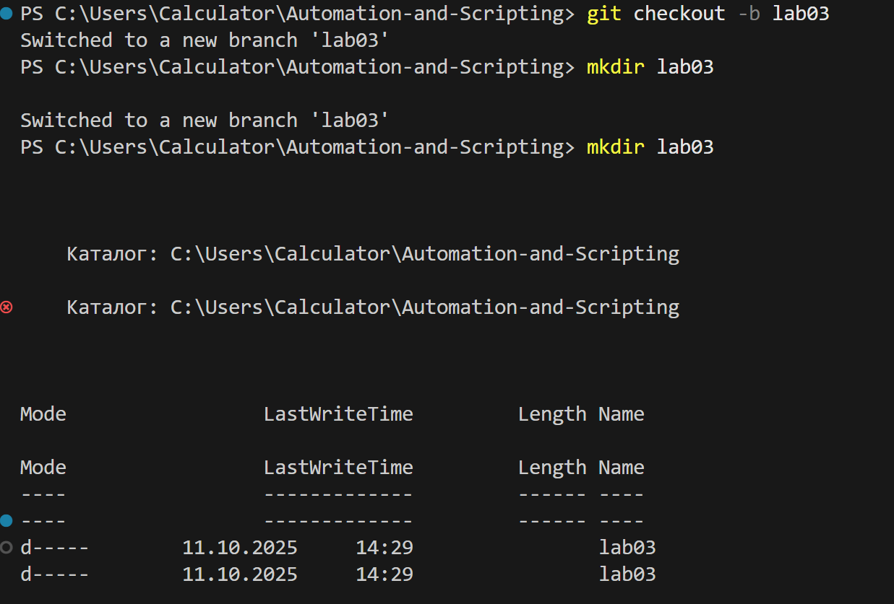
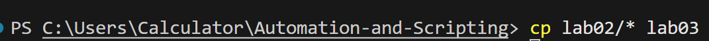

## Lab №3
#### Student: Djurinschi Andrei
#### Group: I2302

------

# задание

Цель
Научиться настраивать планировщик задач (cron) для автоматизации выполнения скриптов.

Подготовка
Это задание основано на лабораторной работе № 2. Скопируйте файлы из лабораторной работы № 2 в новый каталог lab03 для дальнейшей работы.

Задание
В проекте автоматизации создайте ветку lab03. Создайте каталог lab03 и скопируйте в него файлы из лабораторной работы № 2 (папка lab02).

В каталоге lab03 создайте файл cronjob. В этом файле укажите задачи cron, которые будут запускать скрипт currency_exchange_rate.py:

Ежедневно в 6:00 для получения курса молдавского лея к евро за предыдущий день.
Еженедельно по пятницам в 17:00 для получения курса молдавского лея к доллару США за предыдущую неделю.
Создайте Dockerfile в каталоге lab03 на основе Ubuntu или официального образа Python, который:

Установит необходимые зависимости для запуска скрипта (cron, Python и необходимые библиотеки).
Скопирует скрипт currency_exchange_rate.py, файл cronjob и скрипт точки входа в контейнер.
Настроит cron для выполнения задач, указанных в файле cronjob.
Запустит cron в фоновом режиме при запуске контейнера.
Запишет вывод cron-задачи в файл /var/log/cron.log.
Для упрощения работы с cron рекомендуется использовать скрипт точки входа, который настроит и запустит cron. Пример такого скрипта показан ниже:

#!/bin/sh

create_log_file() {
echo "Создание файла журнала..."
touch /var/log/cron.log
chmod 666 /var/log/cron.log
echo "Файл журнала создан в /var/log/cron.log"
}

monitor_logs() {
echo "=== Мониторинг журналов cron ==="
tail -f /var/log/cron.log
}

run_cron() {
echo "=== Запуск демона cron ==="
exec cron -f
}

env > /etc/environment
create_log_file
monitor_logs &
run_cron
Создайте файл docker-compose.yml в каталоге lab03, который будет использовать созданный Dockerfile для сборки образа и запуска контейнера.

Создайте файл readme.md в каталоге lab03, который описывает:

Как собрать и запустить контейнер с помощью cron.

Как убедиться, что задания cron выполняются и вывод записывается в файл /var/log/cron.log.

Описание структуры проекта и назначения каждого файла.
Отправка
Загрузите скрипт в репозиторий GitHub и предоставьте ссылку на него.

------

**Cron file** = это текстовый файл, который содержит расписание задач (скриптов или команд) для автоматического выполнения планировщиком задач cron в операционных системах типа Linux/Unix. Каждая строка в этом файле определяет, какую команду и когда запускать. 

# Выполнение

1) создание ветки и директории проекта 




2) копирование файлов 



3) докер файл [link](/lab03/Dockerfile)

4) скрипт точки входа [link](/lab03/entrypoint.sh)

5) cron файл

```txt
0 6 * * * /usr/bin/python3 /app/currency_exchange_rate.py --from-currency MDL --to-currency EUR --date $(date +\%Y-\%m-\%d --date "yesterday") --key YOUR_API_KEY >> /var/log/cron.log 2>&1
0 17 * * 5 /usr/bin/python3 /app/currency_exchange_rate.py --from-currency MDL --to-currency USD --date $(date +\%Y-\%m-\%d --date "last friday") --key YOUR_API_KEY >> /var/log/cron.log 2>&1
#ДЛЯ СЕБЯ
* * * * * /usr/bin/python3 /app/currency_exchange_rate.py --from-currency MDL --to-currency USD --date $(date +\%Y-\%m-\%d --date "last friday") --key YOUR_API_KEY >> /var/log/cron.log 2>&1

```

- каждый день в 6 утра запрос на получение курса MDL к евро

- каждую пятницу в 17:00 запрос на получение курса MDL к доллару

6) компоуз файл [link](/lab03/docker-compose.yml)

7) Забыл добавить зависимость

```log
Traceback (most recent call last):
  File "/app/currency_exchange_rate.py", line 3, in <module>
    import requests
ModuleNotFoundError: No module named 'requests'
```


